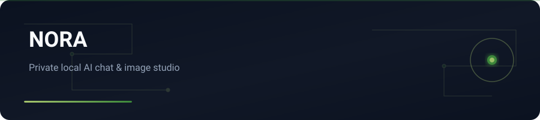
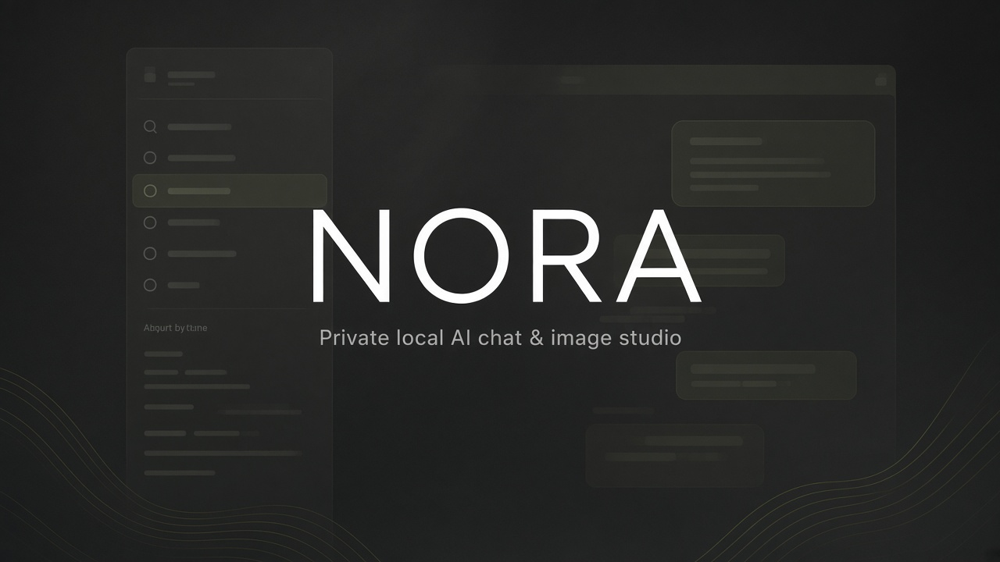

<div align="center">



</div>

# NORA

**Private AI chat & image studio that stays on your machine.**

---

## English

<p align="center"></p>


Persian-first assistant for local models and OpenAI-compatible APIs — chat, image generation, file uploads, and durable memory in one interface.

### Features

- Streamed chat via Ollama or any OpenAI-compatible endpoint
- Local image generation through ComfyUI (or images API when available)
- Attach images, text, CSV, Markdown, or PDF to a turn
- On-disk memory under `data/`
- API widget to switch providers and probe models
- Server binds to `127.0.0.1` only

### Stack

Node.js 18+ · Ollama · ComfyUI · OpenAI-compatible APIs

### Getting started

```bash
git clone https://github.com/yasinfallahati/NORA.git
cd NORA
npm install
npm start
```
Open the local UI (see README / package scripts). Keys stay on your machine.


## License

See repository `LICENSE` (private / project terms).

---

## فارسی

### نورا

استودیوی خصوصی چت و تصویر هوش مصنوعی — روی دستگاه خودتان.

دستیار فارسی‌محور برای مدل‌های محلی و APIهای سازگار با OpenAI — چت، تولید تصویر، آپلود فایل و حافظه پایدار.

### امکانات

- چت جریانی با Ollama یا هر endpoint سازگار با OpenAI
- تولید تصویر محلی با ComfyUI (یا API تصویر در صورت وجود)
- پیوست تصویر، متن، CSV، Markdown یا PDF
- حافظه روی دیسک در پوشه `data/`
- ویجت API برای تعویض ارائه‌دهنده و بررسی مدل‌ها
- سرور فقط روی `127.0.0.1`

### تکنولوژی‌ها

Node.js 18+ · Ollama · ComfyUI · OpenAI-compatible APIs

### شروع کار

```bash
git clone https://github.com/yasinfallahati/NORA.git
cd NORA
npm install
npm start
```
رابط محلی را باز کنید. کلیدها روی دستگاه خودتان می‌مانند.

---

`#ai` `#ollama` `#comfyui` `#nodejs` `#local-ai` `#persian` `#chat` `#privacy`
