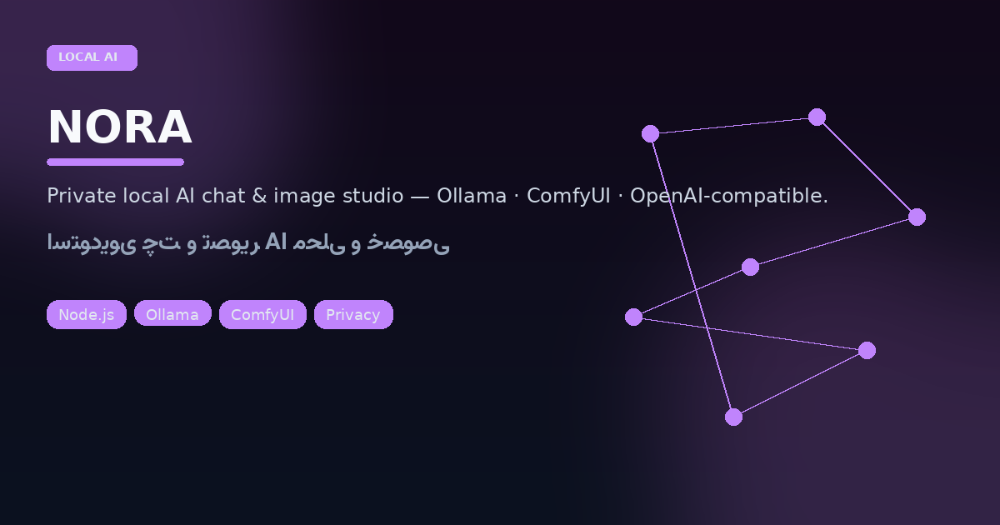
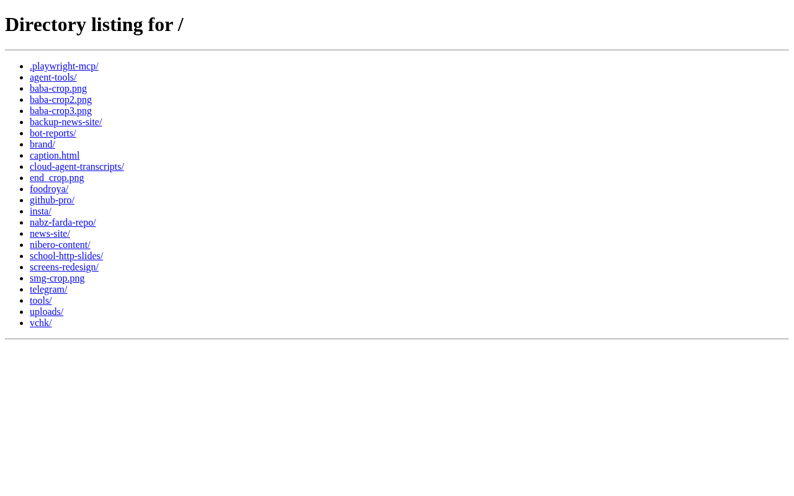

<p align="center"></p>

# NORA
## Private AI that never leaves your LAN

<p align="center">


</p>

<p align="center"></p>

NORA is a **local chat & image studio**: Node static+API server on `127.0.0.1`, Persian system identity (“من Nora هستم و توسط یاسین ساخته شدم”), optional ComfyUI image path, and OpenAI-compatible upstreams when you want them — without shipping your prompts to a random SaaS by default.

### Start

```bash
# Ollama running locally recommended
npm start          # → http://127.0.0.1:3000
# optional:
OLLAMA_URL=http://127.0.0.1:11434 COMFYUI_URL=http://127.0.0.1:8188 npm start
```

Image helper: `start-image-backend.sh`. Extra art in `docs/banner.jpg` / `docs/preview.jpg`.

| Concern | Choice |
|---------|--------|
| Bind | localhost only by default |
| Chat | Ollama / compatible APIs via `lib/upstream` |
| Images | ComfyUI hook + `[[image: …]]` instruction channel |
| Store | Local via `lib/store` |

---

## فارسی — نورا

**استودیوی چت و تصویر هوش مصنوعی محلی.** سرور Node فقط روی لوکال‌هاست، هویت فارسی ثابت، اتصال به Ollama و در صورت نیاز ComfyUI یا APIهای سازگار با OpenAI. هدف: حریم خصوصی و کار آفلاین/LAN، نه وابستگی اجباری به کلود.

### اجرا

```bash
npm start   # http://127.0.0.1:3000
```

### ارزش پیشنهادی

- داده گفتگو روی ماشین خودتان می‌ماند  
- مناسب دموی «AI خصوصی» برای مشتریانی که کلود را نمی‌پذیرند  
- UI فارسی آماده برای کاربر غیرتکنیکال  

لایسنس و جزئیات بیشتر در خود مخزن؛ برای تصویر، بک‌اند Comfy را جدا بالا بیاورید.
