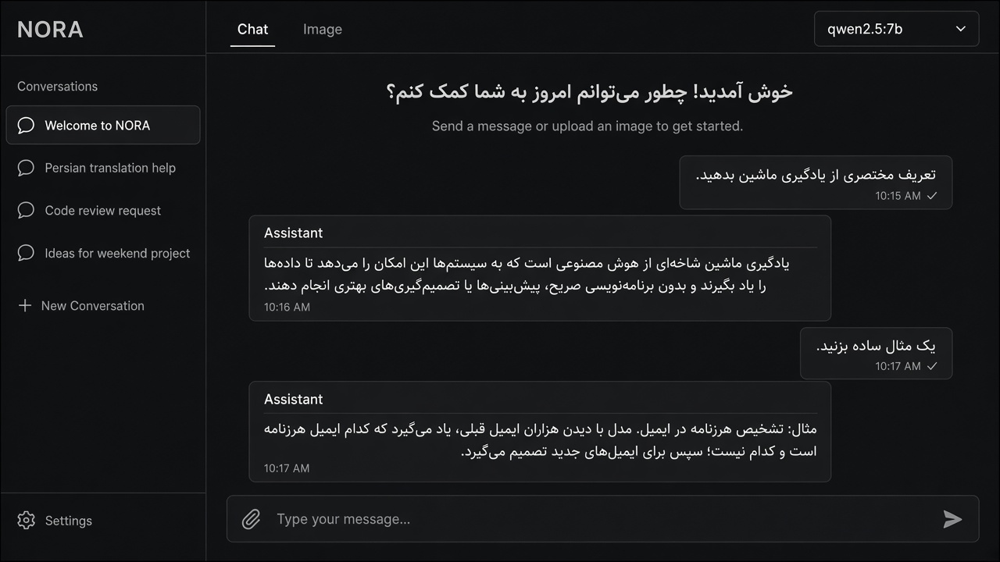

# NORA

**Private AI chat & image studio that stays on your machine.**

Persian-first assistant for local models and OpenAI-compatible APIs — chat, image generation, file uploads, and durable memory in one clean interface.

<p align="center">
  
</p>

<p align="center">
  <a href="#quick-start"></a>
  <a href="#providers"></a>
  <a href="#connect-an-api"></a>
  <a href="LICENSE"></a>
</p>

---

## Why NORA

Most AI UIs push everything to the cloud. NORA is the opposite: a focused Persian workspace where **you** choose the brain — a model on your GPU, or a remote API when you need it — without giving up memory, attachments, or image generation.

| Capability | What you get |
| --- | --- |
| **Chat** | Streamed replies from Ollama or any OpenAI-compatible endpoint |
| **Images** | Local Stable Diffusion via ComfyUI, or an images API when available |
| **Agent uploads** | Attach images, text, CSV, Markdown, or PDF to a turn |
| **Memory** | Facts and conversation notes stored under `data/` on disk |
| **API widget** | Switch providers, probe models, save keys locally |
| **Privacy** | Server binds to `127.0.0.1` only |

---

## Preview

<p align="center">
  
</p>

---

## Architecture

```text
┌─────────────────────┐     ┌──────────────────────┐
│  Browser (Persian)  │────▶│  NORA  ·  Node.js    │
│  chat · files · UI  │◀────│  127.0.0.1:3000      │
└─────────────────────┘     └──────────┬───────────┘
                                       │
              ┌────────────────────────┼────────────────────────┐
              ▼                        ▼                        ▼
       ┌────────────┐          ┌────────────┐          ┌────────────────┐
       │   Ollama   │          │  ComfyUI   │          │ OpenAI-compat  │
       │  chat LLMs │          │  SD images │          │ Gemini / etc.  │
       └────────────┘          └────────────┘          └────────────────┘
                                       │
                                       ▼
                              ┌────────────────┐
                              │ data/          │
                              │ settings ·     │
                              │ chats · memory │
                              │ uploads        │
                              └────────────────┘
```

---

## Features

- **Dual brain** — Use local models by default; flip chat or image generation to an API without rewriting the app.
- **In-chat image requests** — Ask Nora to draw something during a normal conversation; she can trigger image generation when configured.
- **Durable memory** — Explicit “remember this” cues and useful facts are kept and recalled on later turns.
- **Conversation search** — Find old threads from the sidebar.
- **Streaming** — Token-by-token answers for a responsive feel.
- **Zero cloud required** — Fully usable offline with Ollama + ComfyUI.

---

## Quick start

### 1. Prerequisites

- [Node.js](https://nodejs.org/) **18+**
- [Ollama](https://ollama.com/) with at least one chat model (e.g. `qwen2.5:7b`)
- Optional for local images: [ComfyUI](https://github.com/Comfy-Org/ComfyUI) + a checkpoint (see `models/checkpoints/README.md`)

### 2. Run NORA

```bash
git clone https://github.com/yasinfallahati/NORA.git
cd NORA
npm start
```

Open **[http://127.0.0.1:3000](http://127.0.0.1:3000)**.

### 3. Local image backend (optional)

```bash
git clone https://github.com/Comfy-Org/ComfyUI.git ~/ComfyUI
python3 -m venv ~/ComfyUI/venv
~/ComfyUI/venv/bin/pip install -r ~/ComfyUI/requirements.txt
```

Place `dreamshaper_8.safetensors` in `models/checkpoints/`, then in a second terminal:

```bash
./start-image-backend.sh
```

ComfyUI listens on `http://127.0.0.1:8188` with low-VRAM defaults suited to ~4 GB GPUs.

---

## Connect an API

Use **اتصال API** in the sidebar.

| Field | Example |
| --- | --- |
| Chat provider | **API** |
| Image provider | Local ComfyUI *or* API (if your provider supports `images/generations`) |
| Base URL | OpenAI-compatible root, e.g. `https://api.openai.com/v1` |
| API key | Stored only in `data/settings.json` on this machine |
| Chat model | e.g. `gpt-4o-mini`, `gemini-2.0-flash` |
| Image model | Only if the API exposes image models |

### Google AI Studio (Gemini)

| Field | Value |
| --- | --- |
| Base URL | `https://generativelanguage.googleapis.com/v1beta/openai/` |
| API key | From [Google AI Studio](https://aistudio.google.com/apikey) |
| Chat model | e.g. `gemini-2.0-flash` |
| Image | Prefer local ComfyUI — Gemini image routes are not always OpenAI-compatible |

Click **بررسی اتصال** → pick a model → **ذخیره**.

---

## Configuration

| Variable | Default | Purpose |
| --- | --- | --- |
| `PORT` | `3000` | NORA HTTP port |
| `OLLAMA_URL` | `http://127.0.0.1:11434` | Ollama |
| `COMFYUI_URL` | `http://127.0.0.1:8188` | ComfyUI |
| `COMFYUI_DIR` | `~/ComfyUI` | Path used by `start-image-backend.sh` |

Runtime state lives in `data/` (gitignored): settings, conversations, memory, and uploads.

---

## Project layout

```text
NORA/
├── server.js              # HTTP API + static UI
├── lib/
│   ├── store.js           # settings, chats, memory, uploads
│   └── upstream.js        # Ollama · ComfyUI · OpenAI-compatible clients
├── public/                # Persian UI
├── models/checkpoints/    # local SD weights (not in git)
├── start-image-backend.sh # ComfyUI launcher
└── docs/                  # README visuals
```

---

## Roadmap ideas

- Vision-aware defaults for multimodal local models  
- Richer PDF text extraction  
- Export / import memory packs  

---

## License & credit

Built as a personal local assistant (**Nora**, by Yasin). Large model weights are **not** shipped in this repository — pull them yourself and keep them out of git.

---

<p align="center">
  <sub>Local by default · API when you want it · Your data never leaves the machine unless you say so</sub>
</p>
